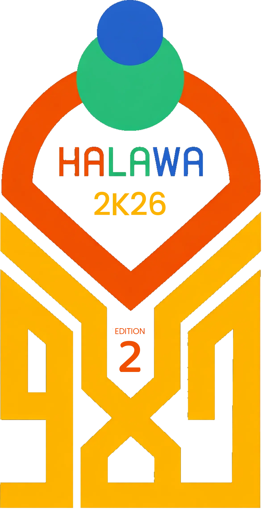

# 🎨 Funoon Fiesta 2.0



> **A Premier Digital Platform for Managing Islamic Art & Culture Festivals**

**Funoon Fiesta** is a comprehensive, full-stack web application designed to streamline the management of large-scale arts festivals. From real-time scoreboards and jury grading to team registrations and admin controls, this platform digitizes the entire festival experience.

Built with modern web technologies, it ensures a seamless, responsive, and engaging experience for organizers, participants, and the audience.

---

## 🚀 Key Features

### 🏆 Live Scoreboard & Results
- **Real-time Updates**: Scores and rankings update instantly without page refreshes.
- **Dynamic Leaderboards**: Visualizes team standings with animated charts and progress bars.
- **Public Results**: detailed result pages for every program with podium highlights.
- **Poster Generation**: Auto-generate and share beautiful result posters directly from the app.

### 🔐 Secure Portals
- **Admin Dashboard**: Complete control over teams, students, programs, and scheduling.
- **Jury Portal**: dedicated interface for judges to grade performances securely.
- **Team Portal**: Team leaders can manage their rosters and register candidates for events.

### 📱 Modern User Experience
- **PWA Support**: Installable as a native-like app on mobile devices.
- **Responsive Design**: Optimized for everything from large projection screens to mobile phones.
- **Dark Mode**: Sleek, accessible UI with dark mode support.
- **AI Chatbot**: Integrated AI assistant to answer queries about the festival.

---

## 🛠️ Tech Stack

*   **Framework**: [Next.js 14](https://nextjs.org/) (App Router)
*   **Language**: [TypeScript](https://www.typescriptlang.org/)
*   **Styling**: [Tailwind CSS](https://tailwindcss.com/) + [shadcn/ui](https://ui.shadcn.com/)
*   **Database**: [MongoDB](https://www.mongodb.com/) (via Mongoose)
*   **Real-time**: [Pusher](https://pusher.com/)
*   **Animations**: [Framer Motion](https://www.framer.com/motion/)
*   **PDF Generation**: [jsPDF](https://github.com/parallax/jsPDF)

---

## 🏁 Getting Started

Follow these steps to set up the project locally.

### Prerequisites
- Node.js (v18+)
- MongoDB (Local or Atlas)

### Installation

1.  **Clone the repository**
    ```bash
    git clone https://github.com/mishabvibes/Funoon-Fiesta2.0.git
    cd Funoon-Fiesta2.0
    ```

2.  **Install dependencies**
    ```bash
    npm install
    ```

3.  **Configure Environment**
    Create a `.env.local` file in the root directory:
    ```env
    MONGODB_URI=mongodb://127.0.0.1:27017/fest_app
    NEXT_PUBLIC_APP_URL=http://localhost:3000
    
    # Pusher Credentials (Optional for local dev)
    PUSHER_APP_ID=your_app_id
    PUSHER_KEY=your_key
    PUSHER_SECRET=your_secret
    PUSHER_CLUSTER=ap2
    ```

4.  **Run the development server**
    ```bash
    npm run dev
    ```

5.  **Open the app**
    Visit `http://localhost:3000` in your browser.

---

## 🔑 Default Credentials

Use these credentials to access the various portals in development mode:

| Role | Username | Password |
| :--- | :--- | :--- |
| **Admin** | `admin` | `admin123` |
| **Jury** | `jury-anika` | `anika@jury` |
| **Team (Aurora)** | `Team Aurora` | `aurora@123` |

> **Note**: See the `teams` collection in MongoDB for other team credentials.

---

## 🤝 Contribution

Contributions are welcome! Please feel free to submit a Pull Request.

1.  Fork the project
2.  Create your feature branch (`git checkout -b feature/AmazingFeature`)
3.  Commit your changes (`git commit -m 'Add some AmazingFeature'`)
4.  Push to the branch (`git push origin feature/AmazingFeature`)
5.  Open a Pull Request

---

## 📄 License

This project is licensed under the MIT License - see the [LICENSE](LICENSE) file for details.

---

<div align="center">
  <p>Made with ❤️ for Art & Culture</p>
</div>
